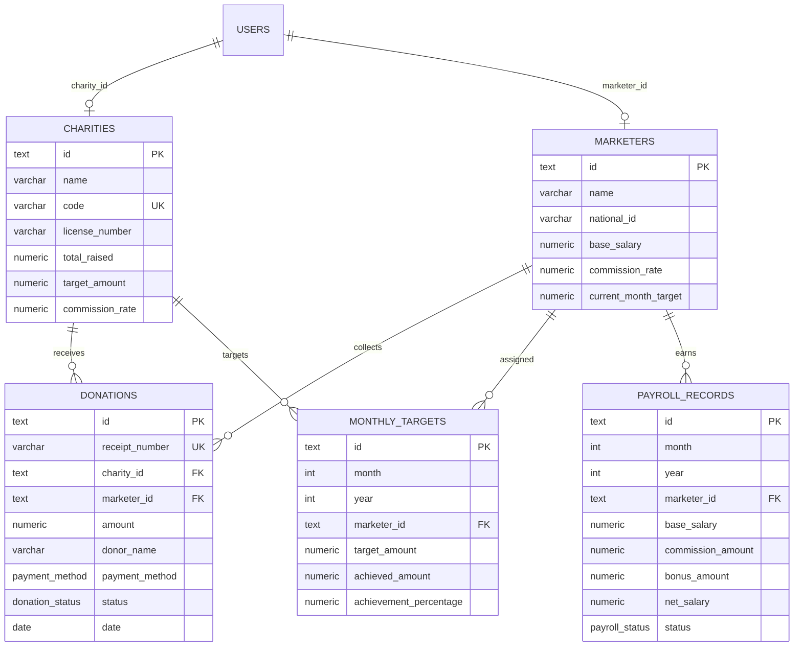

# Ghazara Sales App - Database Architecture & Integration Guide

## 1. Overview
This document outlines the relational database architecture designed for **Ghazara Trading & Marketing**. The schema is optimized for multi-role charity fundraising operations, featuring Row-Level Security (RLS) policies, strict foreign key relationships, performance indexing, and pluggable client repository integration.

---

## 2. Entity-Relationship Diagram (ERD)



---

## 3. Database Security & Isolation (RLS)

| Table | `admin` Role | `marketer` Role | `charity_rep` Role |
| :--- | :--- | :--- | :--- |
| **`charities`** | Full Read / Write | Read assigned | Read own charity profile only |
| **`marketers`** | Full Read / Write | Read own profile | **Blocked** (No access to marketer rosters) |
| **`donations`** | Full Read / Write | Read/Insert own credited sales | Read donations designated for their charity |
| **`monthly_targets`** | Full Read / Write | Read own monthly targets | **Blocked** |
| **`payroll_records`** | Full Read / Write (`draft` -> `paid`) | Read own personal payslip | **Blocked** (No access to internal company payroll) |

---

## 4. Provisioning & Migration Instructions

### Using Supabase or Neon PostgreSQL
1. Open your Supabase SQL Editor or connect via `psql` to your database.
2. Execute [`database/schema.sql`](file:///d:/sales-app/database/schema.sql) to create all tables, enums, indexes, and RLS policies.
3. Execute [`database/seed.sql`](file:///d:/sales-app/database/seed.sql) to seed initial charities, marketers, and donations.
4. Copy `.env.example` to `.env.local` and fill in:
   ```env
   VITE_SUPABASE_URL=https://your-project.supabase.co
   VITE_SUPABASE_ANON_KEY=your-anon-key
   ```
5. The application will automatically detect the credentials and route database operations through `SupabaseRepository`.
